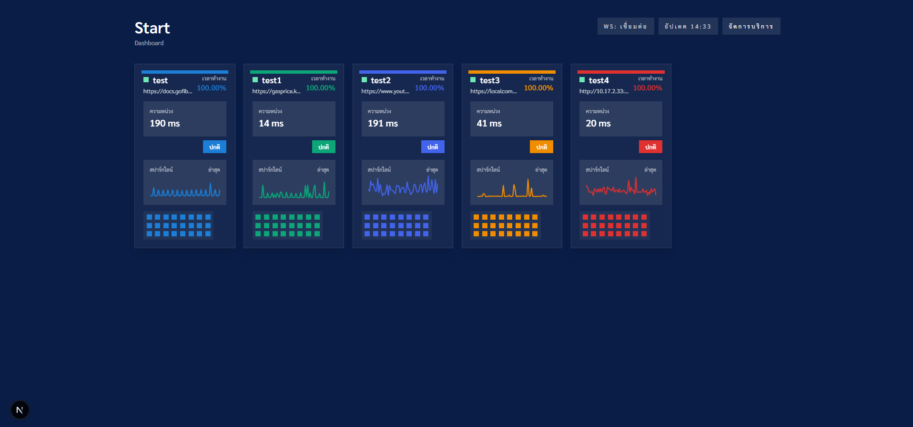

# Uptime Monitoring (Go Fiber + Next.js + Supabase)

ระบบมอนิเตอร์สถานะบริการ (uptime / latency) แบบเรียลไทม์ ประกอบด้วย backend ภาษา Go (Fiber) และ frontend Next.js 14 พร้อม WebSocket สำหรับ push สถานะทันทีที่มีการเช็ก



## สถาปัตยกรรมโดยย่อ
- **Backend (Go Fiber)**  
  - เชื่อมต่อฐานข้อมูล (Supabase/Postgres) เก็บ service, uptime_checks, service_status  
  - Scheduler ตรวจสอบปลายทางแต่ละ service ตาม `interval_sec` และบันทึกผล  
  - WebSocket `/ws/status` push ผลเช็กล่าสุดไปยัง frontend แบบเรียลไทม์  
  - REST API สำหรับดึงสถานะ, เช็กย้อนหลัง, จัดการบริการ

- **Frontend (Next.js / React Chart.js)**  
  - Dashboard แสดงการ์ดบริการ, กราฟ latency, timeline uptime  
  - หน้า Service Detail & Checks รองรับตัวกรองเวลา/จำนวนรายการ  
  - ใช้ WebSocket รับสถานะสด และ fallback polling (interval ปรับตาม `interval_sec`)

## จุดเด่น
- ปรับรอบเช็กต่อ service ได้ (`interval_sec`)  
- Push สถานะทันทีผ่าน WebSocket ลดภาระ polling  
- กราฟภาพรวม/รายละเอียดดูง่าย (Chart.js) และธีมเดียวกันทั้งระบบ  
- มีหน้า CRUD บริการ พร้อม toast แจ้งผลบน UI

## การรัน (สรุป)
```bash
# Backend
cd backend
go mod tidy
go run .

# Frontend
cd frontend
npm install
npm run dev
```

ปรับค่า .env ของ backend/frontend ให้เชื่อมต่อฐานข้อมูลและ API URL/WS URL ตามสภาพแวดล้อมก่อนรันครับ
